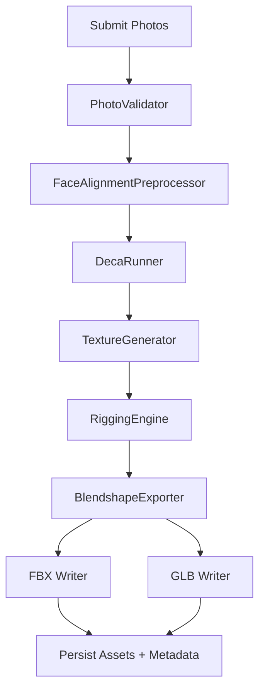

# Live Stream Avatar Pipeline

This repository contains a backend-oriented avatar generation pipeline that ingests user photos, reconstructs a rigged 3D mesh, and packages Unity-ready assets. The implementation focuses on modularity, observability, and deterministic behaviour for automated testing.

## Features

- **Modular pipeline orchestration** covering ingestion, preprocessing, DECA-based reconstruction, rigging, and asset packaging.
- **Input validation and preprocessing** with pluggable validators and face-alignment preprocessing utilities.
- **Persistence** backed by SQLAlchemy models targeting PostgreSQL (tests use SQLite).
- **Asynchronous job handling** via a lightweight in-memory task queue that mirrors Celery semantics; easily replaceable with a production Celery worker.
- **REST API** (FastAPI router) for job submission, status polling, and asset retrieval.
- **Extensive automated tests** (unit + integration) with mockable components.

## Repository layout

```
services/
  avatar_pipeline/
    api/                    # FastAPI router for avatar generation endpoints
    config/                 # Settings management and dependency wiring
    jobs/                   # Async task queue with Celery-compatible API
    orchestrators/          # Stage-specific orchestrators for the pipeline
    persistence/            # SQLAlchemy models and repositories
    preprocess/             # Face alignment preprocessing utilities
    reconstruction/         # DECA runner wrapper
    rigging/                # Rig generation + blendshape export helpers
    textures/               # Texture generation stubs
    validators/             # Photo validation logic
    writers/                # FBX/GLB asset writers with Unity metadata
```

## Getting started

### Prerequisites

- Python 3.11+
- `pip` for dependency management

Install dependencies:

```bash
pip install -r requirements.txt
```

### Environment variables

Configuration is managed through environment variables consumed by `services.avatar_pipeline.config.settings.Settings`. Supported variables:

| Variable | Description | Default |
|----------|-------------|---------|
| `AVATAR_PIPELINE_DATABASE_URL` | SQLAlchemy database URL (PostgreSQL recommended) | `sqlite:///./avatar_pipeline.db` |
| `AVATAR_PIPELINE_BROKER_URL` | Celery broker URL | `memory://` |
| `AVATAR_PIPELINE_BACKEND_URL` | Celery result backend URL | `memory://` |
| `AVATAR_PIPELINE_MODEL_PATH` | Base directory for machine-learning models | `./models` |
| `AVATAR_PIPELINE_DECA_PATH` | Path to DECA model weights | `./models/deca` |
| `AVATAR_PIPELINE_GPU_ENABLED` | Toggle GPU execution (`true`/`false`) | `false` |
| `AVATAR_PIPELINE_TEMP_PATH` | Working directory for intermediate files | `./tmp/avatar_pipeline` |
| `AVATAR_PIPELINE_OUTPUT_PATH` | Directory for packaged assets | `./var/avatars` |
| `AVATAR_PIPELINE_OUTPUT_BUCKET` | Remote/object-storage URI for final assets | `file://./var/avatars` |
| `AVATAR_PIPELINE_ASSET_BASE_URL` | Public URL prefix used in metadata/links | `http://localhost:8000/assets` |

Call `Settings.ensure_directories()` (already done inside the service) to create required directories.

### Running the API locally

Use FastAPI and Uvicorn to expose the avatar routes:

```bash
uvicorn services.avatar_pipeline.api.routes.avatar_generation:router --factory
```

Alternatively, mount the router inside a larger FastAPI app:

```python
from fastapi import FastAPI
from services.avatar_pipeline.api.routes.avatar_generation import router

app = FastAPI()
app.include_router(router)
```

The `/avatar/jobs` endpoints allow you to submit avatar jobs, monitor progress, and list generated assets. By default, the asynchronous queue runs jobs in-process using a thread pool; swap `TaskQueue` in `jobs/avatar_pipeline_tasks.py` with a Celery app to integrate a distributed worker.

### Pipeline overview



### Running tests

The repository uses `pytest` for both unit and integration coverage:

```bash
pytest
```

Tests rely on SQLite databases under `tmp/` directories and mock long-running model calls, so they execute quickly without GPU resources.

### Replacing the task queue with Celery

`services.avatar_pipeline.jobs.avatar_pipeline_tasks.TaskQueue` mimics Celery’s `delay` semantics to keep the test suite lightweight. In production you can replace it with a real Celery application by updating `submit_avatar_job` and the decorator wiring.

## Troubleshooting

- Ensure the configured database URL is writable by the application process.
- When running in Docker/Kubernetes, mount the `temp` and `output` directories to persistent storage so generated assets are retained.
- Use the `JobResponse.queue_state` field to differentiate between queued/running/completed jobs when polling the API.

## License

MIT
